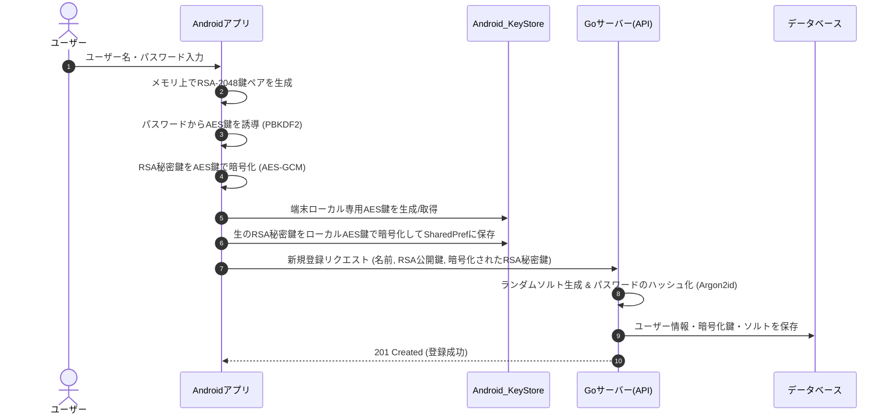
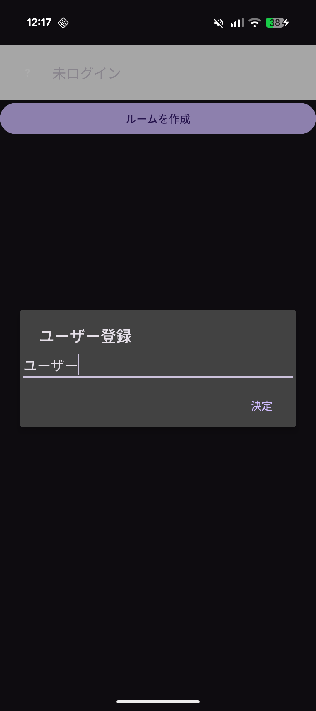
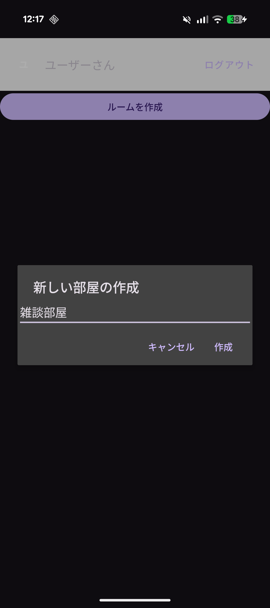
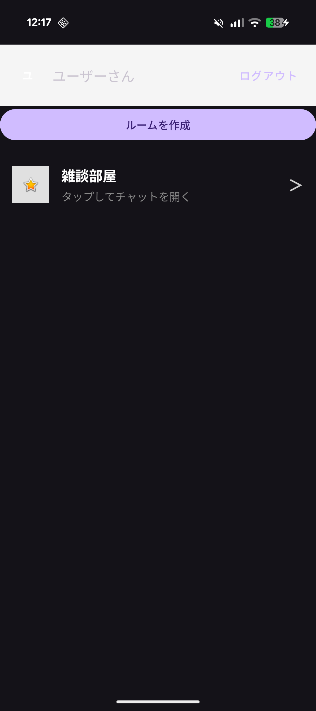
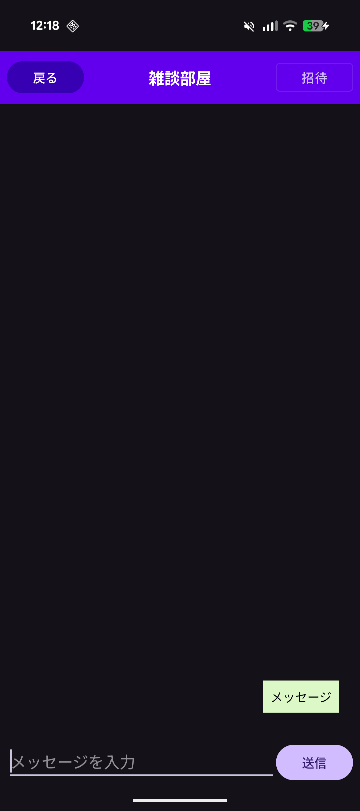
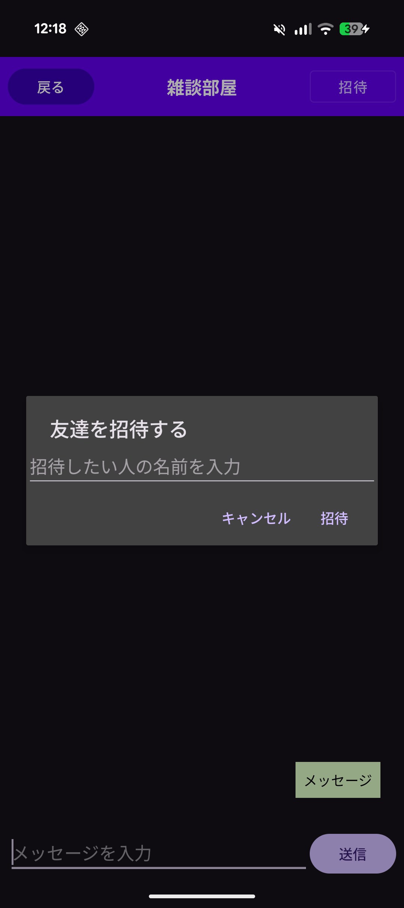
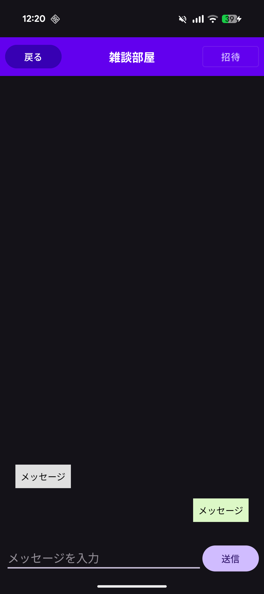

# MyChat
セキュアで高速なチャットを実装しながら、モダンなAndroidアーキテクチャとバックエンド連携を学習するための個人開発プロジェクトです。

## プロジェクトの目的と概要
「フロントエンドからバックエンドまで一貫したデータフローの設計」と「現代のメッセージングアプリに不可欠なセキュリティ（E2EE）とオフラインUXの実装」を身を以て学ぶために開発しました。

### こだわった点
1. **エンドツーエンド暗号化（E2EE）の実装による強固なセキュリティ**
   ハイブリッド暗号方式（AES + RSA）を用いた本格的なE2EEを実装しました。メッセージ本文は送信時に毎回生成される使い捨てのAES共通鍵で暗号化され、そのAES鍵自体をトークルーム参加者全員のRSA公開鍵で個別にカプセル化してサーバーへ送信します。
   復号に不可欠なRSA秘密鍵は、Android OSの最もセキュアな領域である **Android Keystore** 内に厳重に保管され、プログラムからの抽出も不可能なハードウェアレベルの保護を適用しています。これにより、通信経路上の盗聴を防ぐだけでなく、サーバーのデータベース管理者であってもチャット内容を解読できない堅牢なプライバシー保護を実現しました。
2. **Single Source of Truth (SSOT) に基づく堅牢なデータ同期**
   サーバーから取得したデータは一度ローカルDB（SQLite/Room）に保存し、UIは常にローカルDBのみを監視して描画する設計（MVVMアーキテクチャ）を採用。電波がなくても過去のメッセージが見れる快適なUXと、データの不整合を防ぐシステムを構築しました。
3. **Coroutinesを用いた非同期処理によるUIの最適化**
   ネットワーク通信やデータベースの読み書きなど重い処理を非同期で行い、画面のフリーズを防ぎスムーズな操作性を実現しています。

### E2EE実装の詳細

### 画面プレビュー
  
   

## 使用技術・アーキテクチャ
**【フロントエンド (Android)】**
* **言語:** Kotlin
* **通信:** Retrofit (REST API), Gson
* **ローカルDB:** Room (SQLite)
* **非同期処理:** Coroutines / Flow
* **UI/UX:** Navigation Component

**【バックエンド (APIサーバー)】**
* **言語:** Go
* **通信:** net/http 
* **ORM:** GORM

**【データベース / インフラ】**
* PostgreSQL (サーバー側データ永続化)

## 今後の展望 (ToDo)
* WebsocketによるリアルタイムUI更新
* オフライン時の送信エラーハンドリングとリトライ機能の実装
* ルームおよびメッセージの削除機能（論理削除/物理削除の検討）
